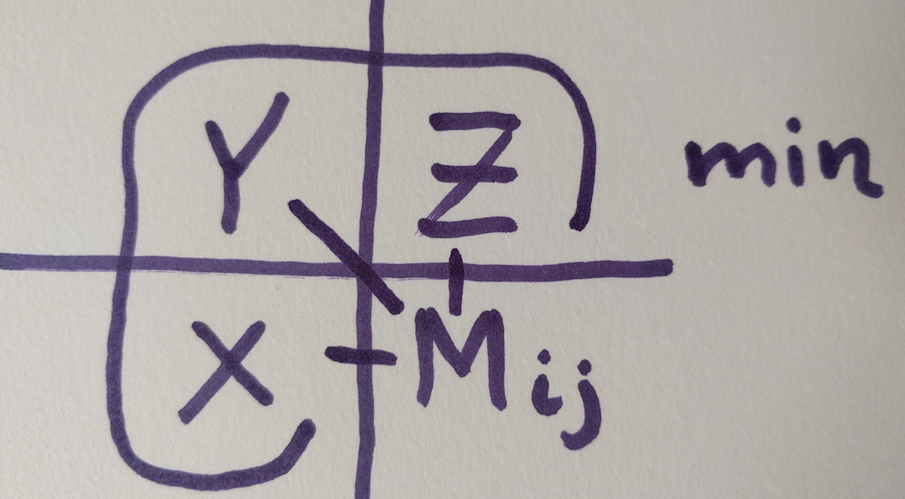
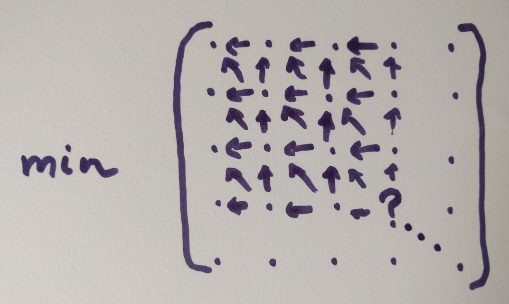

# So...

## I wanted to make a change to [silverpond.com.au](http://silverpond.com.au)

It used to say "we do data-science"...

But we do many things!

## An idea...

I thought a fun idea might be to have this text rewrite itself to various
declarations.

But how should it go about doing this?

I wanted it to look like the text was being edited.

This made me think of the Levenshtein-distance algorithm.

# Levenshtein?

## An Edit-Distance

Between two strings

Imagine editing one string into another.

Each edit-action is associated with a cost.

* Movement costs 0 points
* Replacement, Deletion, and Insertion cost 1 point

## An Edit-Distance

> "hello world" ▻ "hello swirled"

hello world

    ▻hello world 0  hell▻o world  0  hello sw▻orld 0  hello swirl▻d  0
    h▻ello world 0  hello▻ world  0  hello sw▻rld  1  hello swirle▻d 1
    he▻llo world 0  hello ▻world  0  hello swi▻rld 1  hello swirled▻ 0
    hel▻lo world 0  hello s▻world 1  hello swir▻ld 0

> 4 points

## But Optimal

Levenshtein-distance finds the smallest edit distance.

## Various Implementations

* Naively Recursive
* Optimised Recursive
* Full Matrix
* Two row iterative matrix
* Approximate

## But crucially...

We are interested in reconstructing the edits!

A score isn't enough on its own, as the design goal is to have
the intermediate edits of the text displayed to the user.

This rules out the most optimal solutions.

However, we can still use...

## Full-Matrix

The full-matrix implementation of Levenshtein-distance allows for
reconstructing intermediate edits.

# Full-Matrix

## The values in the matrix describe the edit score.

                         --> Insertion
                  TO: R  A  B  B  I  T       Example: "CAT" -> "RABBIT"
       M
                 +--+--+--+--+--+--+--+      Cells contain a score
                 | 0| 1| 2| 3| 4| 5| 6|      that indicates
                 +--+--+--+--+--+--+--+      the cost of editing
         FROM: C | 1| ?| ?| ?| ?| ?| ?|      up to that point.
                 +--+--+--+--+--+--+--+
            |  A | 2| ?| ?| ?| ?| ?| ?|      The point being M[i,j]
            v    +--+--+--+--+--+--+--+      where 'i' represents the
     Deletion  T | 3| ?| ?| ?| ?| ?| ?|      the index into the 'to'
                 +--+--+--+--+--+--+--+      word, and 'j' the 'from'.

Trivially, also works transposed due to symmetry.

## Arbitrary Cell

For any individual cell, the score can be derived in four possible ways,
corresponding to four possible edits.

    +---------+---------+
    |         |         |  Options include:
    |   <----\|    ^    |
    |   N,S   \  D |    |  * (N) Nothing       (+0 Points )
    |         |\   |    |  * (S) Substitution  (+1 Point  )
    +---------+-\ -| ---+  * (D) Deletion      (+1 Point  )
    |         |  \ |   ||  * (I) Insertion     (+1 Point  )
    |   I     |   \|   ||
    |   <----------?   ||  (N) only if From[j] = To[i]
    |         |________||
    +---------+---------+  Pick the minimum option!

## First-Row and Column

        +---------+
        |         | "First Column"
        |    ^    |                           "First Row"
        |  D |    |    Options include:       +---------+---------+
        |    |    |                           |         |        ||
        +-- -| ---+    * (I) Insertion (+1)   |   I     |        || .
        |    |    |    * (D) Deletion  (+1)   |   <-------M[i,0] || .
        | M[0,j]  | .                         +---------+---------+
        |         | .                         |         |         | .
        |_________| .                          .  .  .
        +---------+
          .  .  .

* M[0,0] has a score of 0,
* M[i,0] = Insertion &amp; M[0,j] = Deletion
* &#8756; M[i,0] = i and M[0,j] = j

## Inductive Definition

This is enough to give us a minimal inductive definition for the
scores of all cells of the matrix!

For String F, String T:

* M[0,0] = 0
* M[i,j] = M[i-1,j-1] if F[j] = T[i], otherwise
* M[i,j] = 1 + Minimum( M[i,j-1], M[i-1,j], M[i-1,j-1] )

## Spanning Tree

| | | | | | | |
| --- | --- | --- | --- | --- | --- | --- |
| 0 | ← | ← | ← | ← | ← | ←
| ↑ | ↑ | ↖ | ← | ← | ← | ←
| ↑ | ← | ↖ | ← | ← | ↖ | ←
| ↑ | ← | ↑ | ← | ↑ | ← | ↑

You can visualise this induction as a tree originating from the first cell of
M.

## Spanning Tree

<!--

digraph {
  rankdir=LR;
  M_0_0 [color=red];
  M_0_1 [color=red];
  M_0_1 -> M_0_0;
  M_0_2 -> M_0_1;
  M_0_3 -> M_0_2;
  M_1_0 -> M_0_0;
  M_1_1 -> M_1_0;
  M_1_2 -> M_0_2;
  M_1_3 -> M_0_3;
  M_2_0 -> M_1_0;
  M_2_1 [color=red];
  M_2_1 -> M_0_1;
  M_2_2 -> M_1_1;
  M_2_3 -> M_2_2;
  M_3_0 -> M_2_0;
  M_3_1 [color=red];
  M_3_1 -> M_2_1;
  M_3_2 -> M_2_2;
  M_3_3 -> M_2_3;
  M_4_0 -> M_3_0;
  M_4_1 [color=red];
  M_4_1 -> M_3_1;
  M_4_2 -> M_3_2;
  M_4_3 -> M_4_2;
  M_5_0 -> M_4_0;
  M_5_1 -> M_4_1;
  M_5_2 [color=red];
  M_5_2 -> M_4_1;
  M_5_3 -> M_4_3;
  M_6_0 -> M_5_0;
  M_6_1 -> M_5_1;
  M_6_2 [color=red];
  M_6_2 -> M_5_2;
  M_6_3 [color=red];
  M_6_3 -> M_6_2;
}

-->

## The Final Score

For words F, T:

The final score is the value in the last cell...

M[Length(T), Length(F)]

## Code

    mft f t   = m where
      m       = array bounds [((i,j), lev i j) | (i,j) <- range bounds]
      bounds  = ((0, 0), (length t, length f))
      lev 0 0 = 0
      lev 0 j = succ $ m ! (0     , pred j)
      lev i 0 = succ $ m ! (pred i, 0     )
      lev i j | (f !! p j) == (t !! p i) = m!(p i,p j)
              | True = 1 + minimum [m!(p i,j), m!(i,p j), m!(p i,p j)]

    p         = pred
    score f t = let m = mft f t in m ! snd (bounds m)

Almost a literal translation.

# Memoization

## Recursion Through M

    mft f t   = m where
      ...
      m       = array   ...
      lev i j = ... m ! ...

All data-recursion passes through the array structure.

This acts as a nexus of memoization ensuring that any particular cell
is only calculated once.

# Reconstruction

## We don't just want the score...

Since the branching corresponds to semantic editing actions,
you can keep an editing state in each cell, rather than just track
the score.

## We want the state.

And a cursor position...

        data Cell = C {
                    score  :: Int,
                    state  :: Text,
                    cursor :: Int
                  }

## And we want a path

        type Path = [ Cell ]

## Functions Adjusted

To deal with paths rather than scores.

    scoreH, stateH, charH, targetH :: [Cell] -> N.Nat
    ...

    iM, dM, sM, nM :: Array (Int,Int) [Cell] -> Int -> Int -> [Cell]
    ...

    levensteini :: String -> String -> [Cell]
    levensteini a b = ...
      mini = minimumBy (comparing scoreH)

      lev i j | (ind a j) == (ind b i) = nM m i j
              | otherwise = mini [iM m i j, dM m i j, sM m i j]

## Zippers are Also an Option

Eliminating cursor indexes.

    type Text = Zipper Char

    iT, sT :: Char -> Text -> Text
    ...

    dT, nT :: Text -> Text
    ...

    data Cell = C { state  :: Text
                  , target :: Text
                  , score  :: N.Nat } deriving (Eq, Show)

## We return our tree of paths

The last-cell path can be walked to reconstruct the edits.

<!--

digraph {
  rankdir=RL;
  M_0_0 [color=red];
  M_0_1 [color=red];
  M_0_1 -> M_0_0;
  M_2_1 [color=red];
  M_2_1 -> M_0_1;
  M_3_1 [color=red];
  M_3_1 -> M_2_1;
  M_4_1 [color=red];
  M_4_1 -> M_3_1;
  M_5_2 [color=red];
  M_5_2 -> M_4_1;
  M_6_2 [color=red];
  M_6_2 -> M_5_2;
  M_6_3 [color=red];
  M_6_3 -> M_6_2;
}

-->

Then pruned for NOPs and reversed.

<!--

digraph {
  rankdir=LR;
  CAT -> RAT;
  RAT -> RABT;
  RABT -> RABBT;
  RABBT -> RABBIT;
}

-->

# Laziness

## Haskell is Lazy

Maybe we can gain something simply because Haskell is a lazy language!

## Matrix Laziness

## Looks good

This looks good, since for any particular cell, we only need to compute the
cells above and to the left.

## Why it Isn't so Lazy

## Denied by our Desires

But since we want the value of the bottom-right cell, this means that we
have to compute the entire matrix anyway...

... Unless...

## Natural Laziness

However, in Haskell, numbers can be lazy!

    import qualified Number.Peano.Inf as P
    import qualified Data.Number.Nat  as N

## Allowing for our `min` call to be lazily applied

## Does it work?

Doesn't seem to...

## Why?

Not sure, I believe that it should, so we'll have to dig in another time.

# Big Wins

## Expression of Cyclic Structures

The ability to define your structures as if they were already there!

## Memoization Through Nexuses

Taking advantage of indexed data-structures for memoization feels natural.

# Thanks for Coming!

## Links

<!-- 
bla
 -->

* [This Talk on Github](https://github.com/sordina/mfug_levenshtein_difference_2016_07_07-)
* [Levenshtein Transitions jQuery Library](https://github.com/sordina/levenshtein-transition)
* [Edit-Distance on Haskell Wiki](https://wiki.haskell.org/Edit_distance)
* [edit-distance on Hackage](https://hackage.haskell.org/package/edit-distance)
* Did you know about [Compose :: Melbourne???](http://www.composeconference.org/)
    - Stickers
    - Speakers
